# Benchmark Results

## Mujoco Environments

The MRL SAC/TD3 implementations match the state-of-the-art results on the Mujoco benchmark, mainly due to the use of larger networks. The plots below show the average over 6 seeds for SAC with 512x3 networks, 6 seeds for SAC with 1024x3 networks, and 3 seeds for TD3 with varying network sizes (512x3 is unstable on Hopper, for example). The vertical line marks 300k steps, for comparing sample efficiency. Relevant comparisons include:

- The MRL SAC/TD3 implementations has faster wall clock time (due to environment parallelism) and matches or beats the [Spinning Up benchmarks](https://spinningup.openai.com/en/latest/spinningup/bench.html). 
- MRL SAC implementation obtains similar performance to the [Truncated Quantile Critic (TQC)](https://arxiv.org/abs/2005.04269), appearing at ICML 2020, which is a recent state-of-the-art on this benchmark.
- The model-free sample efficiency here, without overtraining, beats model-based algorithms like MBPO (https://arxiv.org/abs/1906.08253) in some cases (HalfCheetah and Humanoid). Likely we can do even better by training multiple times per step. 

Note that while TD3 matches SAC, it tends to be less stable to choice of hyperparameters. 

#### Training Online

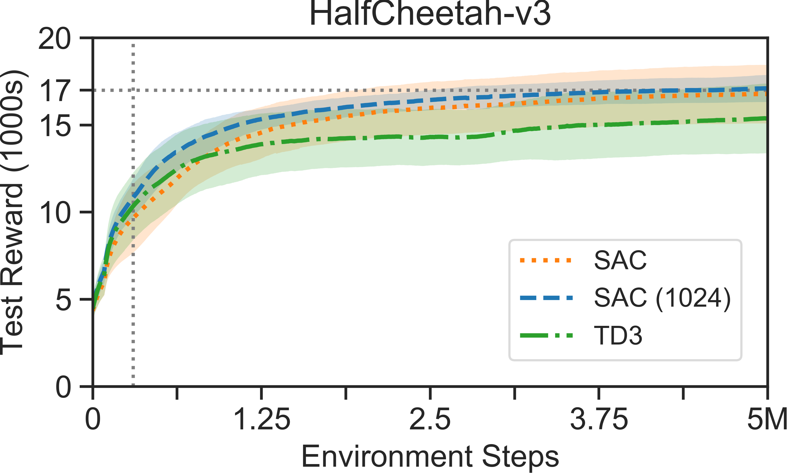
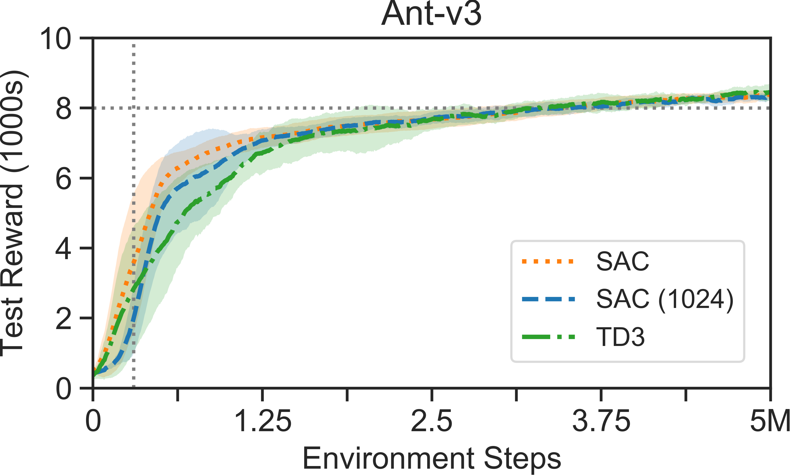
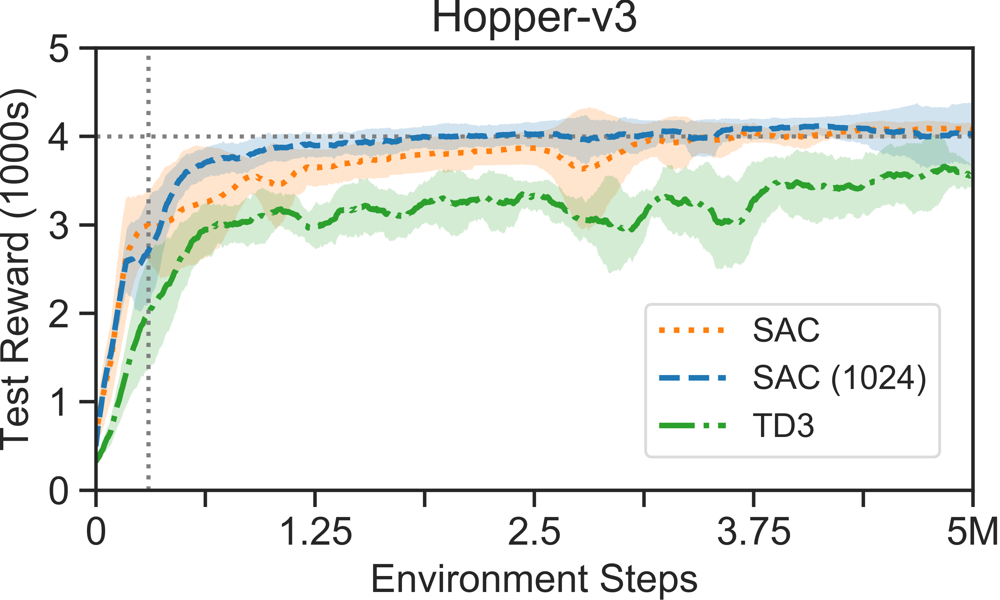
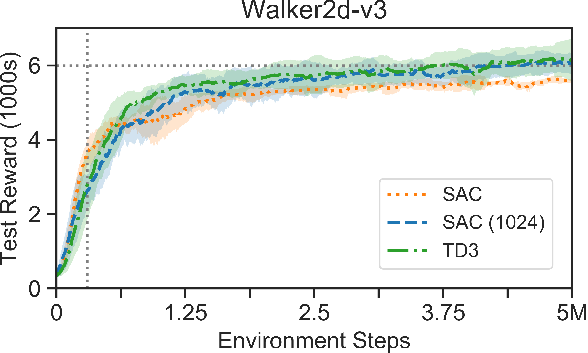
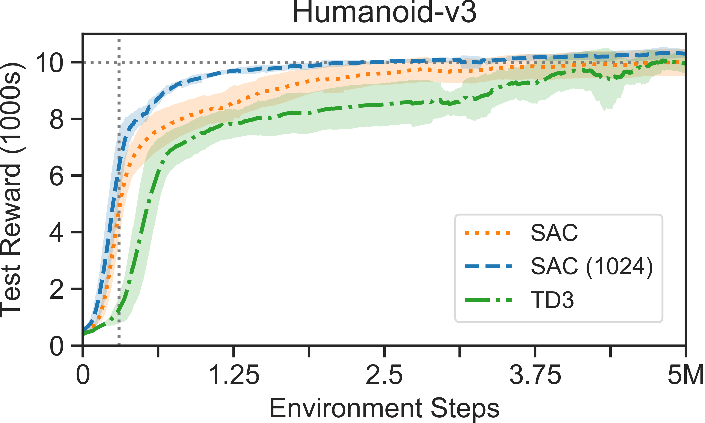

## Robotics Environments

The MRL HER implementation achieves state-of-the-art results on multi-goal benchmarks introduced by [Andrychowicz](https://arxiv.org/abs/1707.01495) and [Plappert](https://arxiv.org/abs/1802.09464), et al., surpassing several follow-up works both in terms of sample efficiency and final performance. The gains here come from a combination of implementation details (esp. mode of parallelism), the use of larger networks, better hyperparameters, and on harder environments, from the [`futureactual` (FA) goal relabeling strategy](https://takonan.github.io/docs/2019_protoge_rldm.pdf). Plots show 3 seeds of each.

Note that while the HER implementation supports TD3/SAC, the DDPG appears to do better in general, possibly due to tuned hyperparameters. 

#### Fetch

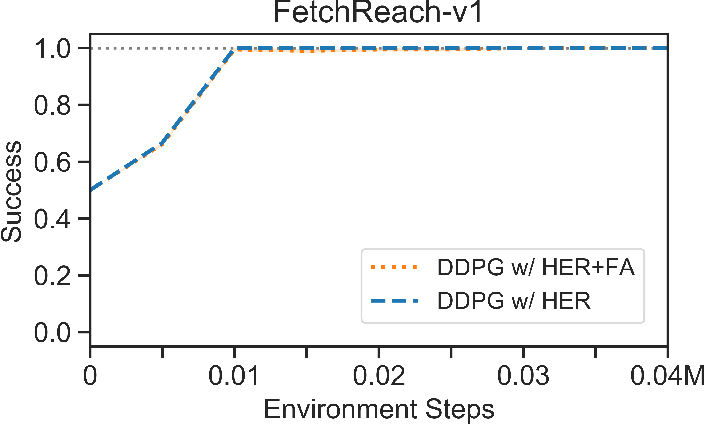
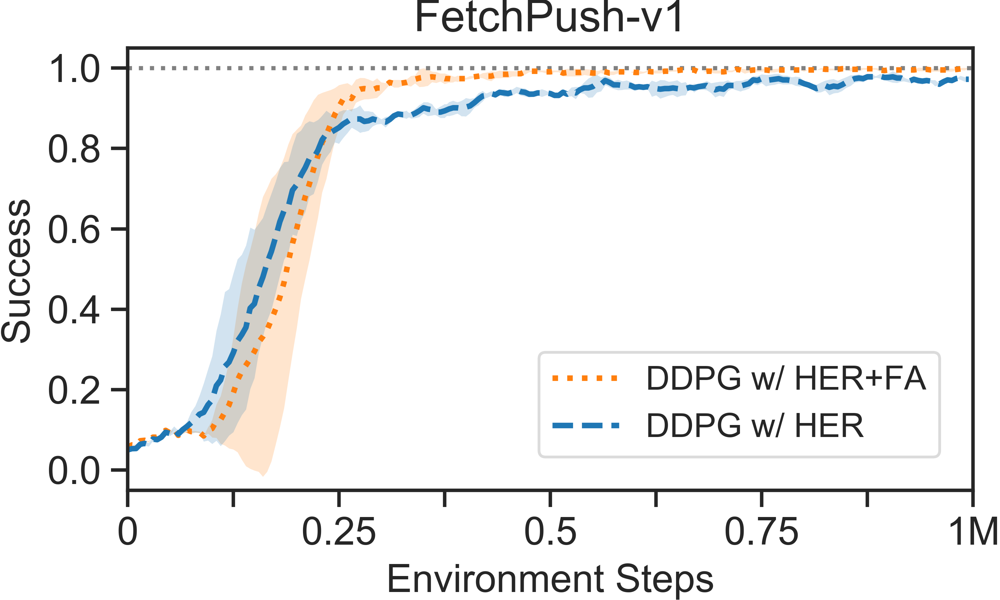
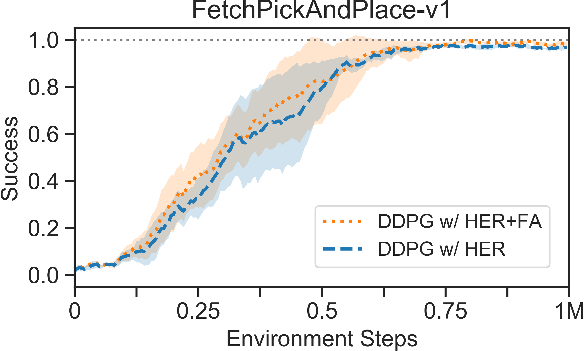
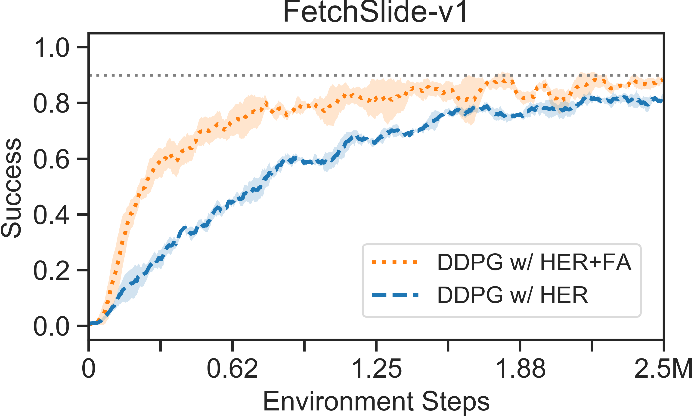

#### Hand

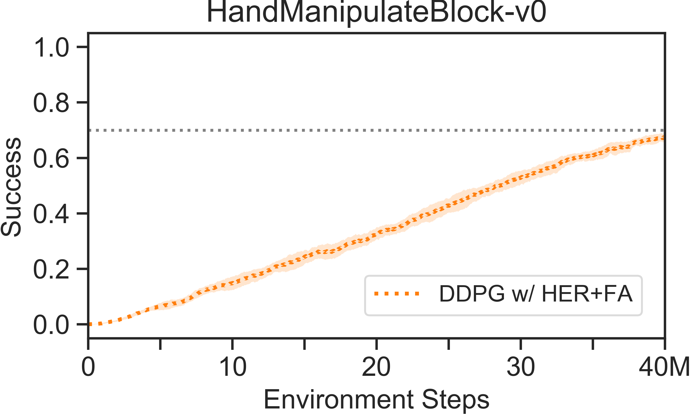
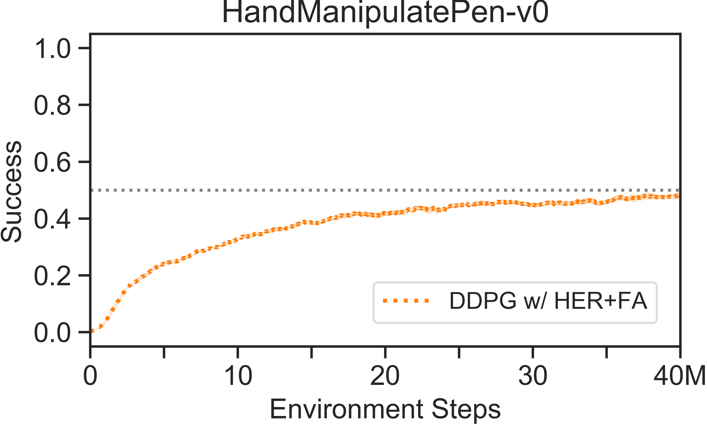 